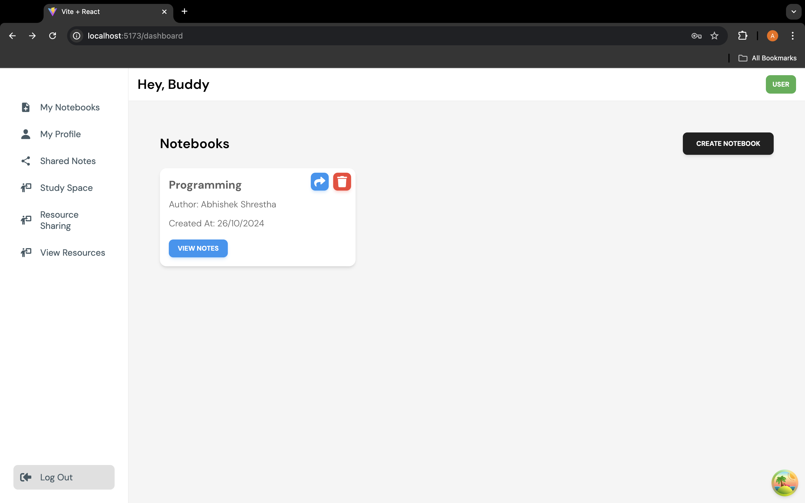
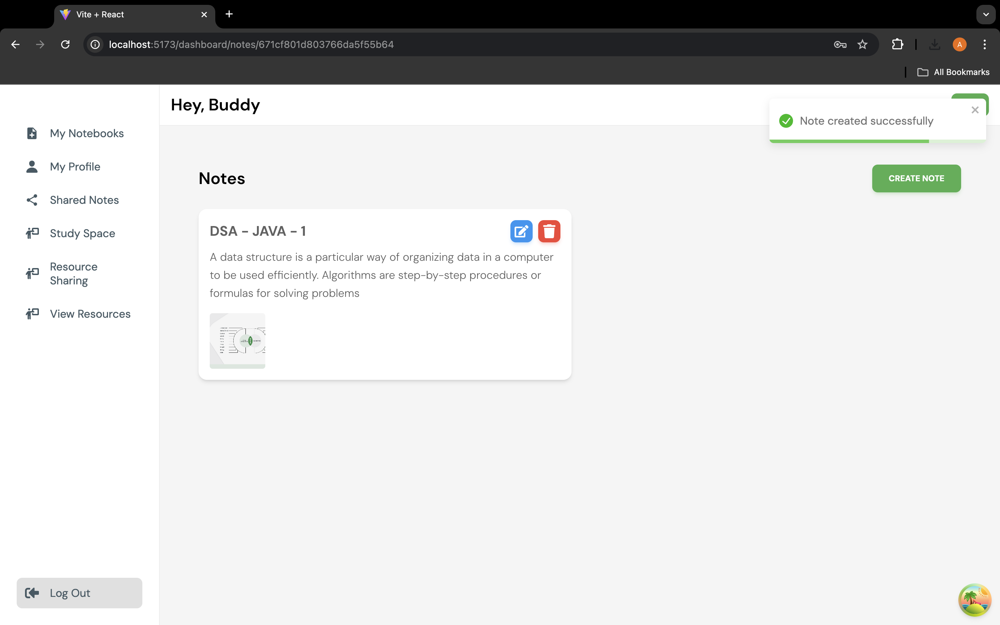
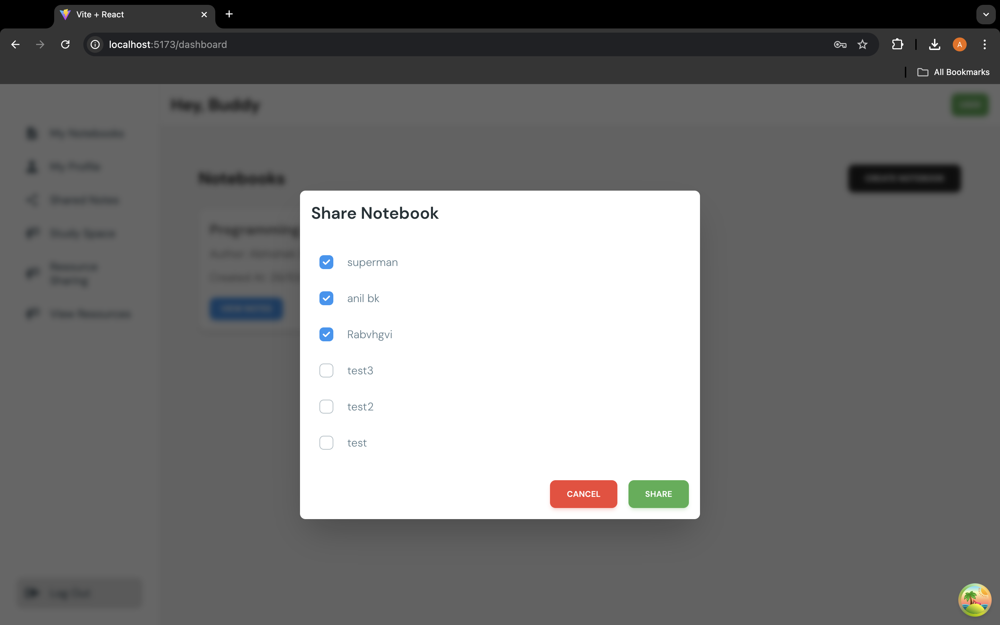
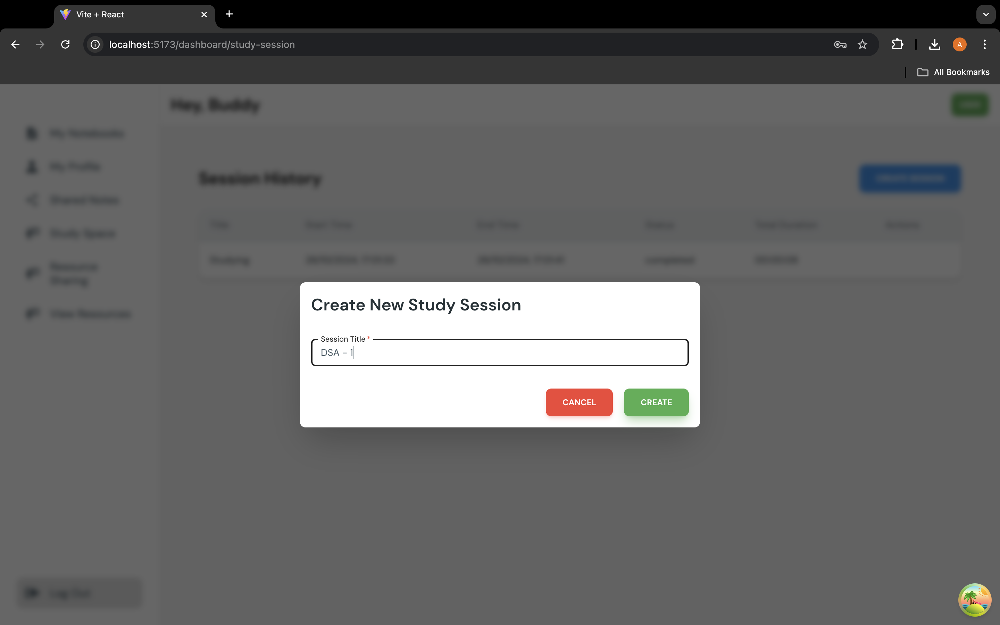
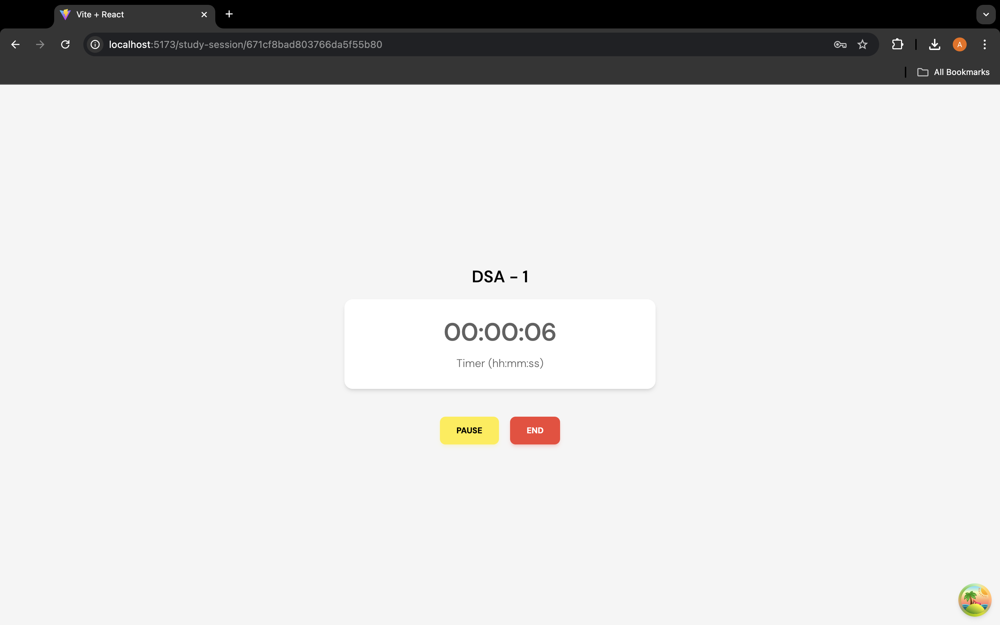
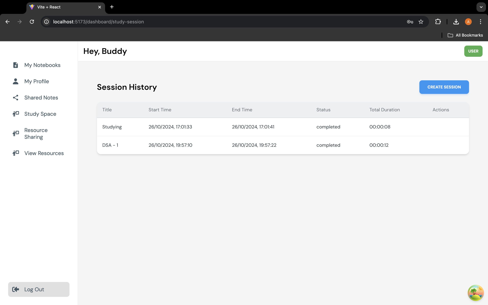
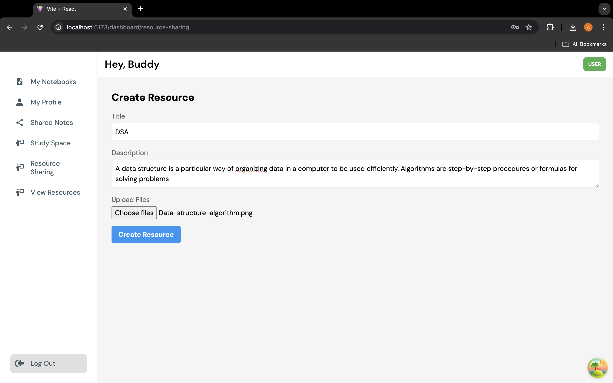
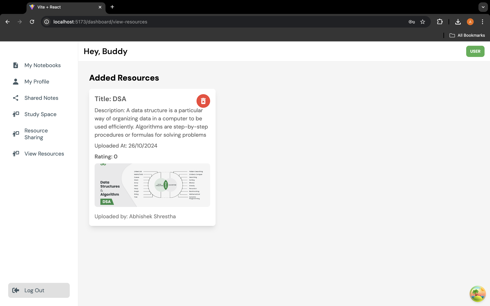

# **Interactive Space Study Platform** – MERN Stack

### **Project Overview**
The Interactive Space Study Platform is a web-based application built using the MERN stack (MongoDB, Express.js, React.js, Node.js) designed to improve productivity and make study sessions more engaging. The platform allows users to take dynamic, nested notes, track their study time, and engage with a distraction-free Focus Mode. Users can also share and interact with study resources through a community-driven resource-sharing library.

### **Features**
- **Dynamic Note-Taking**: 
  - Create, organize, and manage notes with nested functionality.
  - Share notes with other users and collaborate on study materials.
  
- **Study Time Tracking**: 
  - Track study sessions with options to start, pause, and stop the timer.
  - View detailed statistics on study sessions (daily/weekly/monthly).

- **Focus Mode**: 
  - Distraction-free interface to block notifications and reduce distractions.
  - Helps users focus during study sessions.

- **Resource-Sharing Library**: 
  - Upload, share, and provide feedback on study materials and notes.
  - Users can browse and download shared resources from others.

### **Technology Stack**
- **Frontend**: React.js 
- **Backend**: Node.js, Express.js 
- **Database**: MongoDB 

### **Screenshots**

